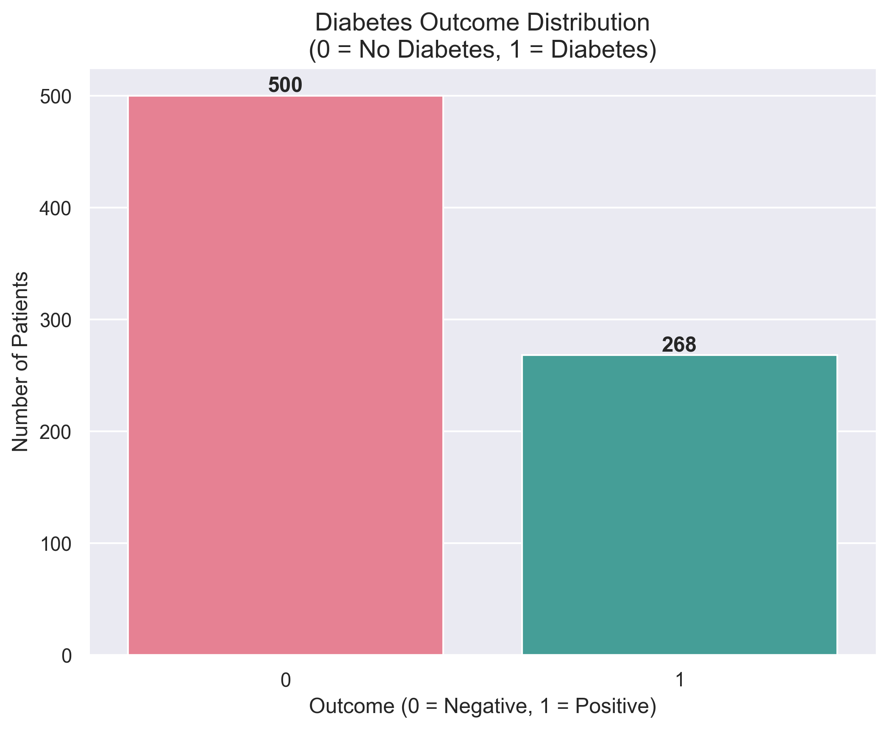
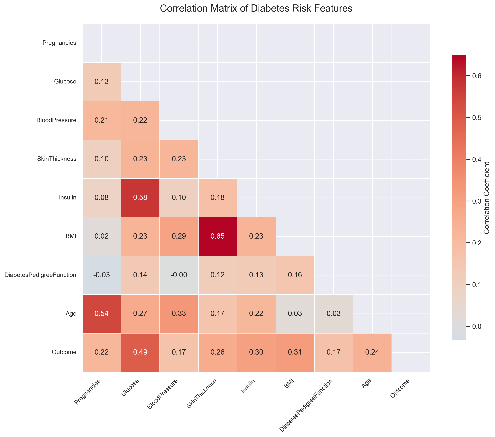
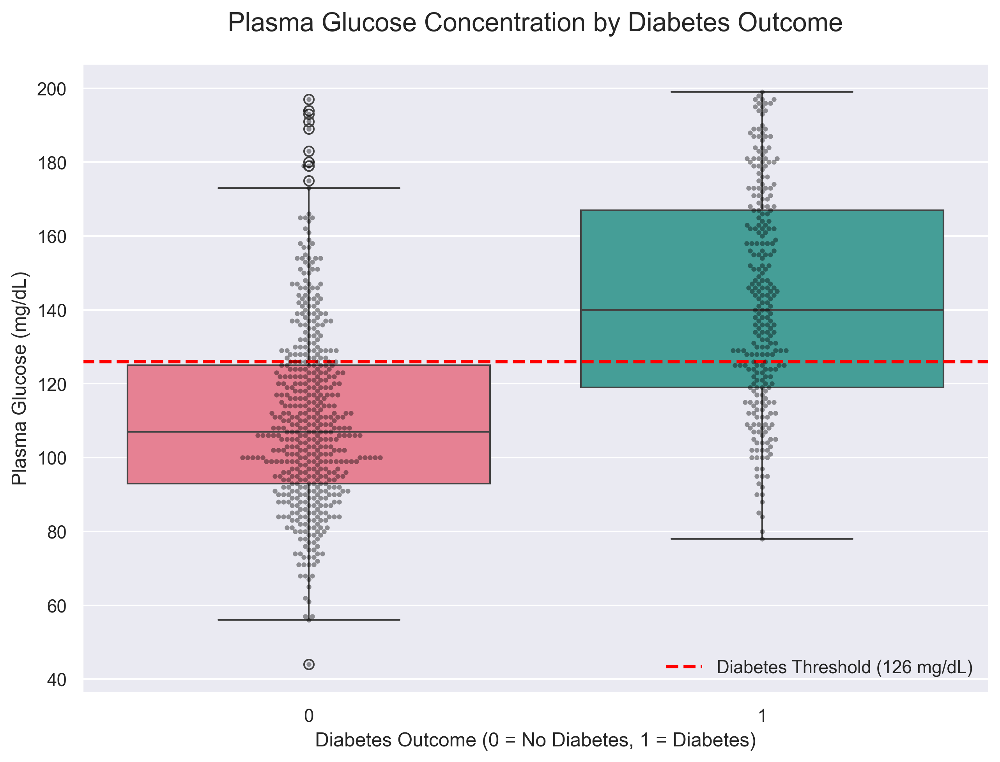
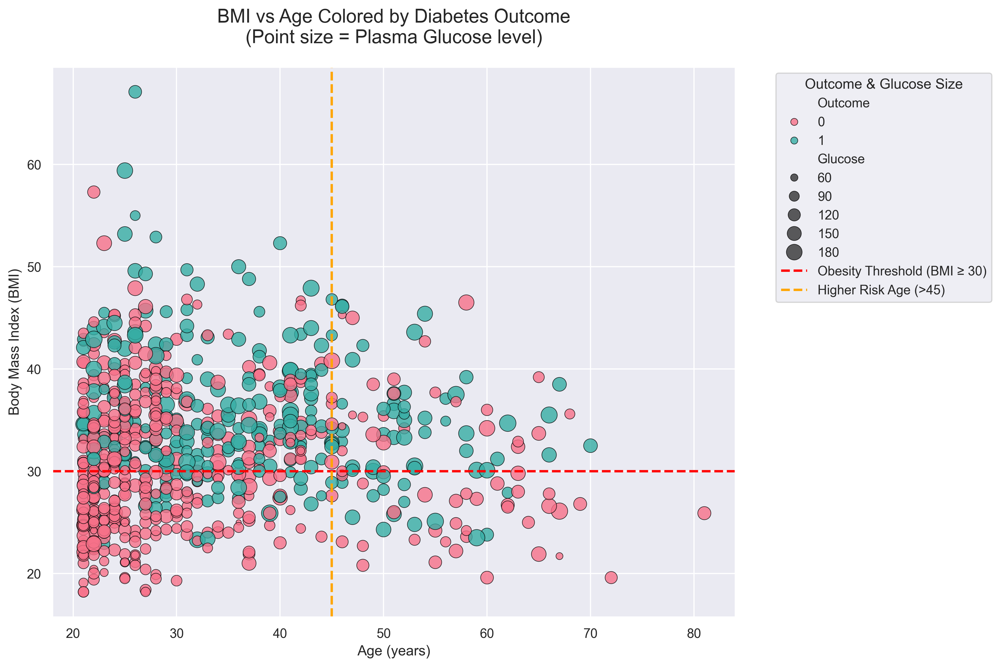

# Diabetes Risk Factors Explorer

**Exploratory Data Analysis of the Pima Indians Diabetes Dataset**

A healthcare-focused portfolio project combining **clinical domain knowledge** with **Python data analysis** skills.

As a physician transitioning into health informatics and data analytics, this project demonstrates end-to-end workflow: data loading, rigorous cleaning of clinically impossible values, insightful visualization, and medical interpretation of a classic diabetes dataset.

## Key Findings
- **Plasma Glucose** is by far the strongest predictor of diabetes outcome (correlation **0.49**), with dramatic separation between diabetic and non-diabetic patients.
- **BMI** (**0.31**) and **Age** (**0.24**) are important risk factors — diabetic patients clearly cluster in regions of higher BMI and older age.
- Proper data cleaning (replacing physiologically impossible zeros with NaN) meaningfully improved correlation accuracy and realism.

## Visualizations

### 1. Outcome Distribution

### 2. Feature Correlation Heatmap

### 3. Glucose Levels by Outcome (with clinical threshold)

### 4. BMI vs Age (Point size = Glucose level)

## Technologies Used
- Python
- Pandas & NumPy – data manipulation and cleaning
- Matplotlib & Seaborn – professional visualizations
- Jupyter Notebook – exploratory analysis

## Project Structure
diabetes-risk-explorer/
├── data/
│   └── diabetes.csv
├── notebooks/
│   └── 01_diabetes_exploratory_analysis.ipynb
├── images/
│   ├── outcome_distribution.png
│   ├── correlation_heatmap.png
│   ├── glucose_by_outcome_boxplot.png
│   └── bmi_vs_age_scatter_final.png
└── README.md

text## Future Improvements
- Build and evaluate predictive models (Logistic Regression, Random Forest, XGBoost)
- Deploy as an interactive web dashboard using Streamlit or Dash
- Extend analysis to larger, modern datasets (e.g., NHANES, UK Biobank, or real-world EHR extracts)

Feedback and suggestions are very welcome!

**Built December 2025**